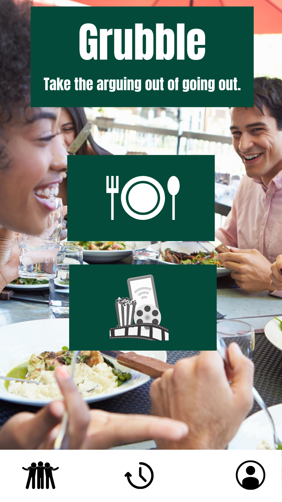

<h1 align=center>
 
  </img>
   

</h1>

<h4 align="center">Final Project for GT Full Stack Boot Camp.</h4>

  
  
  
  
  

  <a href="#team-members">Team Members</a> •
  <a href="#elevator-pitch">Elevator Pitch</a> •
  <a href="#credits">Credits</a> •
  <a href="#related">Related</a> •
  <a href="#license">License</a>

<h1 align=center> </img> </h1>
 

# Team Members:
+ Tyler Roth 
+ Michael Spikes
+ Chris Enright

# Project Roles:
+ Product Owner: Chris
+ Designer: Tyler
+ API Lead: Michael

# Elevator Pitch

Grubble is here to take the frustration or the “I don’t know” out of going out.  This app makes the decision for you based on the preferences and information stored per user.  Whether it’s dining out, or finding a fun activity, Grubble, seamlessly allows you to find something that everyone will enjoy.

# Usage

On first sign up, the user will be brought to a preferences quiz which will allow them to select their favorite foods, activities, and even dietary restrictions.  These preferences will become the basis for their profile and will allow Grubble to tailor the evening to their taste.  Our goal is to allow our users to create a group if they want or just fly solo, and allow the app to decide where they should eat.  At that point they can give the result a "thumb's up" or "roll again".

# Concept to Reality
</img>
</img>

# Credits

This software uses the following open source packages:
+ GitHub
+ VS Code
+ React
+ Material-UI
+ MongoDB Atlas
+ Heroku

## Contributors
+ Tyler: https://github.com/tylerroth15  |  tylerroth1535@gmail.com
+ Michael: https://github.com/michaelspikes85  |  michael.spikes.85@gmail.com
+ Chris: https://github.com/enrightcw  |  enrightcw@gmail.com

## License

